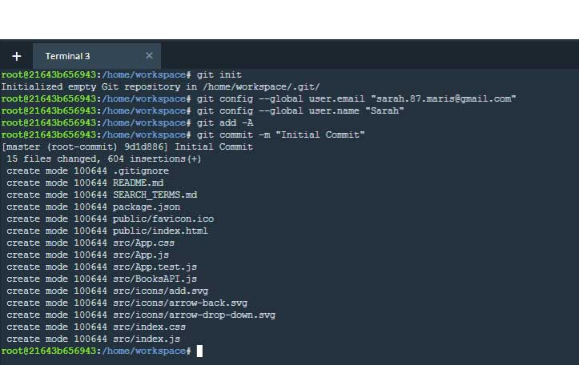

# Setting up a GitHub repo for a Project in the Udacity Workspace


This document should help you get a remote Github repository linked to your Udacity Workspace.  Please note that each Workspace will need its own repo.

##### I. [Instructions](#instructions)  
##### II.  [Troubleshooting](#troubleshooting)

---
## Instructions

### Start in Workspace

1. Initialize the git repo
```bash
git init
```

2. Configure your name and email
```bash
git config --global user.email "you@example.com"
git config --global user.name "Your Name"
```

3. Add and commit existing files:
```bash
git add -A
git commit -m "Initial Commit"
```
Your WorkSpace terminal should look something like this:



### Go to **[GitHub.com](https://github.com/)** and log in:

4. Create a new repository

5. Do _not_ check the "Initialize this repository with a README" radio button
   Create a new repository


6. On the next page, copy the code in the ***push an existing repository from the command line*** section:
&nbsp;  


### Go back to Workspace

7.  Paste in the terminal:
```bash
git remote add origin https://github.com/your-name/yourrepo.git
git push -u origin master
```

8.  Enter your Github username and password when prompted:


---

## Troubleshooting

### If there is already a git repo in the Workspace:
1. Go to the root of the project and delete the repo with this code:
```bash
rm -fr .git
```

2. Start over at [step 1](#instructions) above
